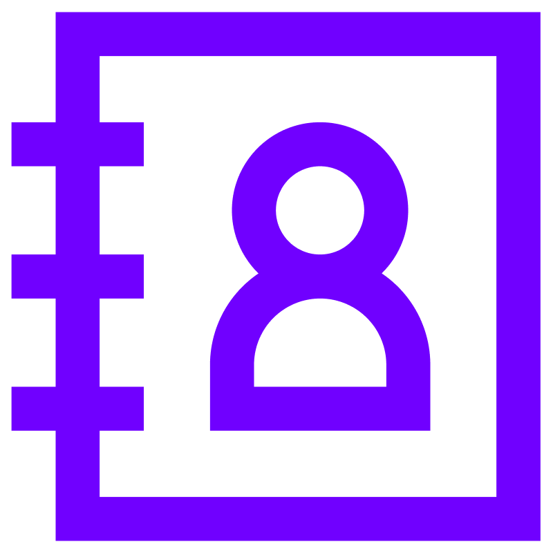

<h1>

  

Phonebook app</h1>

<h2>The app was created for people who want to make their own phonebook, where they can add contacts, edit them, or delete them if necessary.</h2>

Tech
stack:

<ul>
<li>React.js, </li>
<li>React-router-dom,</li> 
<li>React-loader-spinner,</li>
<li>Axios,</li>
<li>Styled-Components,</li> 
<li>mockAPI,</li>
<li>Github pages,</li>
<li>Git.</li>
</ul>
